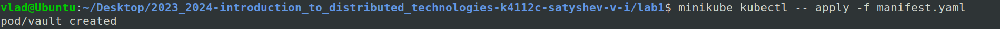

University: [ITMO University](https://itmo.ru/ru/)
Faculty: [FICT](https://fict.itmo.ru)
Course: [Introduction to distributed technologies](https://github.com/itmo-ict-faculty/introduction-to-distributed-technologies)
Year: 2023/2024
Group: K4112c
Author: Satyshev Vladislav Igorevich
Lab: Lab1
Date of create: 01.10.2023
Date of finished:


# 1. Установка Docker и minikube
Для запуска minikube с Docker в качестве isolation software выполним команду:
```bash
minikube start --driver=docker
```
Результат выполнения команды представлен на рисунке:


# 2. Манифест для развертывания "пода" HashiCorp Vault
Манифест для развертывания "пода" HashiCorp Vault прилагается.
Комментарии по содержанию manifest.yaml:
manifest.yaml (object definition) составляется в соответствии с object model Kubernetes, которая включает в себя ряд обязательных полей:
- `apiVersion` - используемая версия API;
- `kind` - тип описываемого объекта;
- `metadata` - метаданные;
- `spec` - конфигурация объекта;

В данной лабораторной работе manifest.yaml используется для создания Pod (наименьший объект рабочей нагрузки (smallest workload object), единица развертывания (unit of deploymen) Kubernetes), котррый представляет собой набор логически свзанных друг с другом контейнеров и volumes в изолированном окружении. Pod присвоено имя `"vault"` и `namespace` `default`, а также `label` `app` со значением `"vault"`. Pod включает в себя один контейнер, названный `"vault-container"`, запускаемый с образа (image) `"vault:1.13.3"`. Поле `ContainerPort` указывает порт контейнера, который будет доступен для кластера Kubernetes (8200). Данному порту также присваивается имя `"http"`.

Далее требуется запустить описанный Pod:
```bash
kubectl apply -f manifest.yaml
```
Результат выполнения команды представлен на рисунке:


# 3. Создание сервиса для доступа к контейнеру
> In Kubernetes, a Service is a method for exposing a network application that is running as one or more Pods in your cluster. 
> You use a Service to make that set of Pods available on the network so that clients can interact with it.

Для создания сервиса можно воспользоваться `kubectl expose`, который находит controller, service, replica set или pod по имени и делает его доступным извне (expose) в качестве нового сервиса Kubernetes. Флаг `--type=NodePort` указывает, что необходимо сделать доступным извне указанный далее порт (`--port=8200`).
Итак, создадим сервис для доступа к созданному контейнеру:
```bash
minikube kubectl -- expose pod vault --type=NodePort --port=8200
```

# 4. Прокидывание порта компьютера в контейнер
Воспользуемся `kubectl port-forward`:
```bash
minikube kubectl -- port-forward service/vault 8200:8200
```
Данная команда перенаправляет трафик с клиентского устройства по указанному порту (`8200`) на указанный порт (`8200`) сервиса пода vault (`service/vault`).
После этого можно зайти в vault в браузере (http://localhost:8200).
Окно браузера представлено на рисунке:


# 5. Вход в vault
Для поиска токена, необходимого для входа воспользуемся `kubectl logs`:
```bash
minikube kubectl logs vault
```
`kubectl logs` используется для получения логов из контейнера в указанном поде. Отметим, что, если в поде находится только один контйнер, то не требуется указывать имя контейнера.
Результат выполнения команды представлен на рисунке:

Скопируем Root Token и испольузем его для входа:


# 6. Схема организации контейеров и сервисов
Схема организации контейеров и сервисов представлена на рисунке:


- kube-apiserver - API сервер, который связывает управляющие комоненты Control Plane с нодами кластера;
- kube-scheduler - используется для создания новых объектов рабочей нагузки (workload objects);
- kube-controller-manager - постоянно работающий процесс, который сравнивает текущее состояние кластера с желаемым. В случае несоответствия принимает меры по приведению состояния к желаемому.
- etcd - это строго согласованное, распределенное хранилище данных «ключ-значение», используемое для сохранения состояния кластера Kubernetes.
- docker engine - Kubernetes требует наличия среды выполнения контейнеров на нодах, т.к. на них запускаются контейнеры.
- kubelet - процесс, взаимодействующий с control plane: получает определения пода и взаимодействует со средой выполнения контейнеров для запуска указанных контейнеров. Также выполняет мониторинг состояния и ресурсов подов.
- kube-proxy - процесс, ответственный за динамические обновления и обслуживание всех сетевых правил на ноде, перенаправляет внешние запросы в контейнеры.
