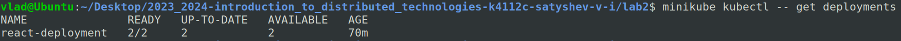
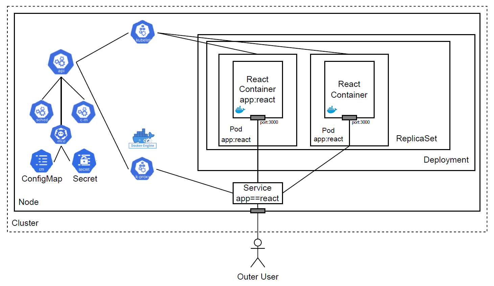

University: [ITMO University](https://itmo.ru/ru/)
Faculty: [FICT](https://fict.itmo.ru)
Course: [Introduction to distributed technologies](https://github.com/itmo-ict-faculty/introduction-to-distributed-technologies)
Year: 2023/2024
Group: K4112c
Author: Satyshev Vladislav Igorevich
Lab: Lab2
Date of create: 08.10.2023
Date of finished: 


# 1. Создание deployment с двумя репликами контейнера
Перед тем как приступить к созданию `deployment` обратим внимание на то, что потребуется задать переменные окружения `REACT_APP_USERNAME` и `REACT_APP_COMPANY_NAME`. В связи с этим создадим `ConfigMap`.

`ConfigMap` позволет отделить детали конфигурации от образа контейнера. Используя ConfigMaps, мы передаем данные конфигурации в виде пар ключ-значение, которые используются `Pod` или другими системными компонентами и контроллерами. 
В данной работе `ConfigMap` используется для передачи в контейнер переменных среды, однако, следует отметить, что `ConfigMap` может также передавать наборы команд и аргументов или `volumes`.
Манифест для создания `ConfigMap` представлен далее:

```yaml
apiVersion: v1
kind: ConfigMap
metadata:
  name: config-map-react
data:
  username: TestUser
  companyName: TestCompany
```
- `apiVersion` - используемая версия API;
- `kind` - тип описываемого объекта;
- `.metadata.name` - название `ConfigMap`;
- `data` - перечисление пар ключ-значение;

Создадим `ConfigMap`:
```bash
minikube kubectl -- apply -f config_map_manifest.yaml
```
Покажем, что `ConfigMap` был успешно создан:


Заметим также, что для скачивания требуемого образа необходима авторизация в Docker Hub. В связи с этим создадим `Secret`, содержащий конфигурационные данные.
`Secret` по своей сути похожи на `ConfigMap` и отличаются тем, что хранящаяся в них информация кодируется, что повышает безопасность (информация не передается как plain text). Отметим, что для повышения безопасности рекомендуется зашифровать данные, прежде чем помещать их в `Secret` (и, соответственно, расшифровывать при использовании).
Для создания `Secret` можно воспользоваться командой:
```bash
minikube kubectl -- create secret docker-registry regcred \
  --docker-server=https://index.docker.io/v1/
  --docker-username=vladsatyshev \
  --docker-password=mypassword \
  --docker-email=sateshev5@yandex.ru \
```
Данная команда создает `Secret` с именем `regcred`, содержащий аутентификационные данные для Docker Hub.

Покажем, что `Secret` был успешно создан:


Создадим `Deployment` с двумя репликами контейнера [ifilyaninitmo/itdt-contained-frontend:master](https://hub.docker.com/layers/ifilyaninitmo/itdt-contained-frontend/master/images/sha256-08756f1022aea55538e740562aa980b56be6241d2166e6d8d6521386e0876dbe?context=explore).

`Deployment` предоставляет декларативные обновления для Pod и ReplicaSets. Принцип работы `Deployment` состоит в том, что создается описание желаемого состояния, после чего фактическое состояние стремится к желаемому за счет работы  deployment контроллера.
`Deployment` может быть использован в [ряде случаев](https://kubernetes.io/docs/concepts/workloads/controllers/deployment/#use-case). В настоящей работе `Deployment` задействован для развертывания набора реплик (`ReplicaSet`). 
Цель `ReplicaSet` - поддерживать стабильный набор `Pod`, работающих в любой момент времени. Таким образом, `ReplicaSet` используется для гарантии доступности определенного количества идентичных `Pod`, что позволяет масштабировать проект горизонтально.

Манифест для создания `Deployment` представлен далее:

```bash
apiVersion: apps/v1
kind: Deployment
metadata:
  name: react-deployment
  labels:
    app: react
spec:
  replicas: 2
  selector:
    matchLabels:
      app: react
  template:
    metadata:
      labels:
        app: react
    spec:
      containers:
      - name: react-container
        image: ifilyaninitmo/itdt-contained-frontend:master
        env:
        - name: REACT_APP_USERNAME
          valueFrom: 
            configMapKeyRef:
              name: config-map-react
              key: username
        - name: REACT_APP_COMPANY_NAME
          valueFrom:
            configMapKeyRef:
              name: config-map-react
              key: companyName  
        ports:
        - containerPort: 3000
      imagePullSecrets:
      - name: regcred
```

- `.spec.replicas` - указывает количество реплик;
- `.spec.selector` - указывает каким образом созданный `ReplicaSet` должен определить, каким из `Pod` управлять. В данном случае используется селектор по label (`matchLabels`), который указывает, что `ReplicaSet` управляет `Pod` у которых имеется label `app` со значением `react`;
`template` - описывает шаблон по которому будут создаваться реплики: указывается соответсвующий label (`app: react`) и спецификация;
- В спецификации указывается название контейнра (`name: react-container`), образ, на основе которого контейнер создается (`image: ifilyaninitmo/itdt-contained-frontend:master`), переменные окружения, с требуемыми в описании контейнера названиями (`REACT_APP_USERNAME`, `REACT_APP_COMPANY_NAME`), взятые из созданного ранее `ConfigMap`. `ConfigMap` находится по его имени (`name: config-map-react`), а значения переменных - по указанным в `ConfigMap` ключам (`key: username`, `key: companyName`). Поле `ContainerPort` указывает порт контейнера, который будет доступен для кластера Kubernetes.
- `imagePullSecrets` - указывает, какой `Secret` использовать при скачивании образа.

Покажем, что `Deployment` был успешно создан:


Покажем, что `ReplicaSet` был успешно создан:


Покажем, что было успешно создано 2 `Pod`:


# 2. Создание сервиса для доступа к "подам"
- Заметим, что созданный `Deployment` не гарантирует, что во время всего жизненного цикла кластера созданный набор `Pod` будет неизменным. В частности, это значит, что присвоенные каждому `Pod` IP адреса кластера могут изменяться. Например, в случае уничтожения и повторного создания `Pod` (из-за какой-нибудь ошибки внутри контейнера) IP адрес может измениться. При этом все клиенты клиенты или другие `Pod`, которые взаимодействовали с этим пересозданным `Pod` напрямую (т.е. посредством IP адреса этого пода) более не смогут с ним взаимодействовать из-за того, что `Pod` был присвоен новый IP адрес.
- Заметим также, что в силу использования `ReplicaSet` возникает неоднозначность в том, к какому из двух созданных `Pod` следует выполнять запросы.

Для решения описанных выше проблем можно воспользоваться `Service`, которые используются для предоставления доступа набору `Pod` к сети (в том числе и за пределами кластера).

Манифест для создания `Service` представлен далее:

```yaml
apiVersion: v1
kind: Service
metadata:
  name: react-service
spec:
  type: NodePort
  selector:
    app: react
  ports:
    - port: 3000
      targetPort: 3000
      nodePort: 30000
```

Используется тип сервиса `NodePort` для того, чтобы сделать `Pod` доступными вне кластера. Это значит, что при подключении к `Node` по порту `30000` `Node` будет перенаправлять трафик на ClusterIP созданного сервиса (который, в свою очередь, перенаправляет трафик на один из двух созданных `Pod`). Также указывается порт самого сервиса (`port: 3000`) и порт подов (`targetPort: 3000`).
Отметим также, что для определения того, какие `Pod` сервис должен обслуживать используется `selector` по label (`app: react`), который был установлен в манифесте `Deployment`.

Покажем, что `Service` был успешно создан:


# 3. Подключение к контейнерам через веб браузер
Для подключения к созданным контейнерам через веб браузер перенаправим трафик с одного из портов клиентского устройства на порт сервиса, подобно тому, как это было выполнено в лабораторной работе №1:

```bash
minikube kubectl -- port-forward service/react-service 3000:3000
```

После этого React приложение становится доступным в браузере:


# 4. Проверка переменных `REACT_APP_USERNAME`, `REACT_APP_COMPANY_NAME` и `Container name` на странице в браузере
Как можно видеть из представленного выше скриншота значения переменных `REACT_APP_USERNAME`, `REACT_APP_COMPANY_NAME` и `Container name` доступны внутри контейнера.
- Доступность переменных `REACT_APP_USERNAME` и `REACT_APP_COMPANY_NAME` можно объяснить использованием `ConfigMap` (рассмотрено в п.1).
- Доступность переменной `Container name` можно объяснить тем, что в контейнерах Kubernetes имя пода хранится в виде переменной окружения `HOSTNAME`. [source](https://kubernetes.io/docs/concepts/containers/container-environment/) 

Покажем это, выполнив внутри пода следующие команды:
```bash
minikube kubectl -- exec react-deployment-7bd88477fb-4xxcv -- printenv REACT_APP_USERNAME
minikube kubectl -- exec react-deployment-7bd88477fb-4xxcv -- printenv REACT_APP_COMPANY_NAME
minikube kubectl -- exec react-deployment-7bd88477fb-4xxcv -- printenv hostname
```


# 5. Проверка логов контейнеров

Логи обоих контейнеров представлены далее:


Видно, что логи одинаковы. Это можно объяснить тем, что оба контейнера созданы на основе одного и того же образа.

# 6. Схема организации контейеров и сервисов
Схема организации контейеров и сервисов представлена на рисунке:



- kube-apiserver - API сервер, который связывает различные объекты Kubernetes друг с другом;
- kube-scheduler - используется для создания новых объектов рабочей нагузки (workload objects);
- kube-controller-manager - постоянно работающий процесс, который сравнивает текущее состояние кластера с желаемым. В случае несоответствия принимает меры по приведению состояния к желаемому. 
- etcd - это строго согласованное, распределенное хранилище данных «ключ-значение», используемое для сохранения состояния кластера Kubernetes.
- docker engine - Kubernetes требует наличия среды выполнения контейнеров на нодах, т.к. на них запускаются контейнеры.
- kubelet - процесс, взаимодействующий с control plane: получает определения пода и взаимодействует со средой выполнения контейнеров для запуска указанных контейнеров. Также выполняет мониторинг состояния и ресурсов подов. В данном случае также отвечает за инициализацию переменных окружения из `ConfigMap` и аутентификацию с помощью `Secret`, информацию о которых получает посредством kube-apiserver. 
- kube-proxy - процесс, ответственный за динамические обновления и обслуживание всех сетевых правил на ноде. В частности, за настройку iptables.