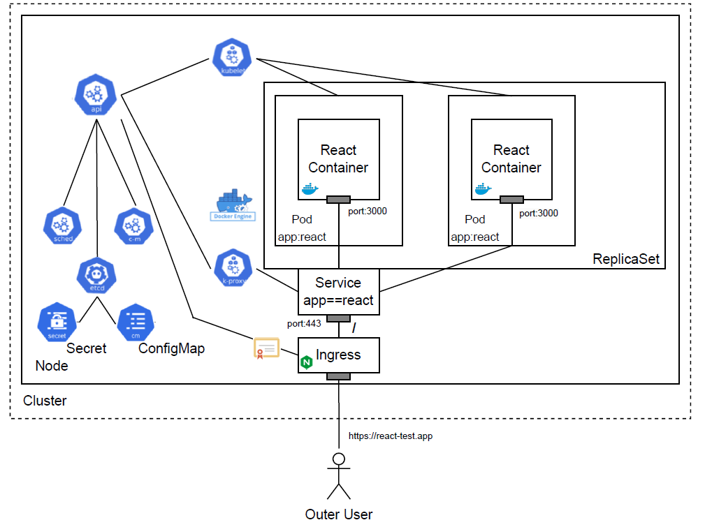

University: [ITMO University](https://itmo.ru/ru/)
Faculty: [FICT](https://fict.itmo.ru)
Course: [Introduction to distributed technologies](https://github.com/itmo-ict-faculty/introduction-to-distributed-technologies)
Year: 2023/2024
Group: K4112c
Author: Satyshev Vladislav Igorevich
Lab: Lab3
Date of create: 12.10.2023
Date of finished: 


# 1. Создание `ConfigMap`
Создадим `ConfigMap` с переменными: REACT_APP_USERNAME, REACT_APP_COMPANY_NAME.
`ConfigMap` позволет отделить детали конфигурации от образа контейнера. Используя ConfigMaps, мы передаем данные конфигурации в виде пар ключ-значение, которые используются `Pod` или другими системными компонентами и контроллерами. 
Манифест для создания `ConfigMap` представлен далее:

```yaml
apiVersion: v1
kind: ConfigMap
metadata:
  name: config-map-react
data:
  username: TestUser
  companyName: TestCompany
```

- `apiVersion` - используемая версия API;
- `kind` - тип описываемого объекта;
- `.metadata.name` - название `ConfigMap`;
- `data` - перечисление пар ключ-значение;

Создадим `ConfigMap`:
```bash
minikube kubectl -- apply -f config_map_manifest.yaml
```
Покажем, что `ConfigMap` был успешно создан:


# 2. Создание `ReplicaSet` с 2 репликами контейнера [ifilyaninitmo/itdt-contained-frontend:master](https://hub.docker.com/repository/docker/ifilyaninitmo/itdt-contained-frontend)

Цель `ReplicaSet` — поддерживать стабильный набор `Pod`, работающих в любой момент времени. Таким образом, `ReplicaSet` используется для гарантии доступности определенного количества идентичных `Pod`.

Манифест для создания `ReplicaSet` представлен далее:

```yaml
apiVersion: apps/v1
kind: ReplicaSet
metadata:
  name: react-replicaset
  labels:
    app: react
spec:
  replicas: 2
  selector:
    matchLabels:
      app: react
  template:
    metadata:
      labels:
        app: react
    spec:
      containers:
      - name: react-container
        image: ifilyaninitmo/itdt-contained-frontend:master
        env:
        - name: REACT_APP_USERNAME
          valueFrom: 
            configMapKeyRef:
              name: config-map-react
              key: username
        - name: REACT_APP_COMPANY_NAME
          valueFrom:
            configMapKeyRef:
              name: config-map-react
              key: companyName  
        ports:
        - containerPort: 3000 
      imagePullSecrets:
      - name: regcred
```

Основная информация заключена в `.spec`:
- `replicas` - указывается количество реплик;
- `selector.matchLabels.app` - указывается, что `ReplicaSet` следит за подами, которые находит по принципу совпадения label `app` (`app==react`).
- `template` - описывает шаблон по которому будут создаваться реплики: указывается соответсвующий label (`app: react`) и спецификация;
- В спецификации указывается конфигурация контейнера (`container`). Так, указывается название контейнра (`name: react-container`), образ, на основе которого контейнер создается (`image: ifilyaninitmo/itdt-contained-frontend:master`), переменные окружения, с требуемыми в описании контейнера названиями (`REACT_APP_USERNAME`, `REACT_APP_COMPANY_NAME`), взятые из созданного ранее `ConfigMap`. `ConfigMap` находится по его имени (`name: config-map-react`), а значения переменных - по указанным в `ConfigMap` ключам (`key: username`, `key: companyName`). Поле `ContainerPort` указывает порт контейнера, который будет доступен для кластера Kubernetes.
- `imagePullSecrets` - указывает, какой `Secret` использовать при скачивании образа. Используется `Secret` `regcred`, который был создан в работе №2.

Покажем, что `ReplicaSet` был успешно создан:


Покажем, что было успешно создано 2 `Pod`:


Создадим также сервис, обеспечивающий доступ к созданным `Pod`.
Манифест для создания `Service` представлен далее:

```yaml
apiVersion: v1
kind: Service
metadata:
  name: react-service-lab3
spec:
  type: ClusterIP
  selector:
    app: react
  ports:
    - protocol: TCP
      port: 443
      targetPort: 3000
```

Отметим, что в отличии от работы №1 и №2 в данном случае допускается использовать тип сервиса `ClusterIP`, а не `NodePort`, т.к. доступ извне будет осуществляться с посредством `Ingress`, который создается в п. 4 данной работы. Заметим также, что установлен 443 `port` по которому доступен `Service` внутри кластера, т.к. будет использоваться https соединение.

Покажем, что `Service` был успешно создан:


# 3. Генерация TLS сертификата и добавление его в minikube
Для того, чтобы браузер дал доступ к приложению требуется создать собственный Certificate Authority, с помощью которого необходимо сгенерировать TLS сертификат.
Набор действий, который необходимо выполнить для достижения указанной задачи, основывается на [статье](https://devopscube.com/create-self-signed-certificates-openssl/) и представлен на рисунке:


## 3.1 Создание Certificate Authority
Выполним следующую команду:

```bash
openssl req -x509 \
            -sha256 -days 356 \
            -nodes \
            -newkey rsa:2048 \
            -subj "/CN=react-test.app/C=RU/L=Saint Petersburg" \
            -keyout rootCA.key -out rootCA.crt 
```

- `req` - создает и обрабатывает запросы сертификатов. Может создавать самозаверяющие сертификаты, что в данном случае и используется.
- `x509` - указывает, что создается самоподписанный сертификат.
- `sha256` - алгоритм хеширования.
- `days 356` - время жизни сертификата.
- `newkey rsa:2048` - указывается, что нужно создать приватный (секретный) RSA ключ длиной 2048 бит.
- `subj "/CN=react-test.app/C=RU/L=Saint Petersburg"` - устанавливает CN (Common Name) - полное имя системы, которая использует сертификат. В случае статического разрешения доменного имени в данном поле требуется указать имя хоста или IP-адрес; C - Country, L - localityName.
- `keyout rootCA.key -out rootCA.crt` - указываются файлы, в которые будут помещены ключ и сертификат.

## 3.2 Создание сертификата для minikube
1. Создадим приватный RSA ключ длиной 2048 бит:

```bash
openssl genrsa -out server.key 2048
```

2. Создадим CSR (Certificate Signing Request)

```
[ req ]
default_bits = 2048
prompt = no
default_md = sha256
req_extensions = req_ext
distinguished_name = dn

[ dn ]
C = RU 
L = Saint Petersburg 
CN = react-test.app

[ req_ext ]
subjectAltName = @alt_names

[ alt_names ]
DNS.1 = react-test.app
IP.1 = 192.168.49.2
```

- `default_bits` - длина ключа;
- `promt=no` - отключение запроса информации у пользователя при попытке создать сертификат; 
- `default_md`- default message digest (указывается алгоритм хеширования);
- `req_extensions` - включает добавление расширений к CSR на основе конфигурационного файла. В данном случае, добавляются DNS имя (`DNS.1`) и IP (`IP.1`). Отметим, что т.к. фактически описанные в данном пунтке действия выполняются уже после создания `Ingress` (рассмотрено в п. 3), то IP `Ingress` известен;
- `[ dn ]` - рассмотрено ранее;
- `subjectAltName` - расширение альтернативного имени субъекта позволяет включать в файл конфигурации различные литеральные значения. К ним относятся адрес электронной почты (адрес электронной почты), URI (Uniform Resource indicator), DNS имя, RID, IP-адрес, dirName (distinguished name) и otherName.

Выполним команду для создания .crs файла:

```bash
openssl req -new -key server.key -out server.csr -config csr.conf
```

3. Создадим сертификат

Конфигурационный файл для сертиификата представлен далее:

```
authorityKeyIdentifier=keyid,issuer
basicConstraints=CA:FALSE
keyUsage = digitalSignature, nonRepudiation, keyEncipherment, dataEncipherment
subjectAltName = @alt_names

[alt_names]
DNS.1 = react-test.app
```

- `authorityKeyIdentifier=keyid,issuer` - `keyid` - говорит о том, что при генерации сертификата выполняется попытка скопировать subject key identifier (хэш) из родительского сертификата (rootCA.crt), `issuer` - копирует issuer и серийный номер из сертификата, который выдает создаваемый сертификат (rootCA.crt).
- `basicConstraints=CA:FALSE` - указывает, что создаваемый сертификат не является сертификатом Certificate Authority.
- `keyUsage = digitalSignature, nonRepudiation, keyEncipherment, dataEncipherment`:
  - `digitalSignature` - cертификат может использоваться для применения цифровой подписи;
  - `nonRepudiation` - не позволяет подписывающему лицу отрицать факт подписания;
  - `keyEncipherment` - сертификат может использоваться для шифрования симметричного ключа;
  - `dataEncipherment` - сертификат может использоваться для шифрования и расшифровки реальных данных приложения;
- `subjectAltName` - рассмотрено ранее.

Выполним команду для генерации сертификата:

```bash
openssl x509 -req \
    -in server.csr \
    -CA rootCA.crt -CAkey rootCA.key \
    -CAcreateserial -out server.crt \
    -days 365 \
    -sha256 -extfile cert.conf
```

Таким образом, в результате выполнения п. 3 было создано 7 файлов, которые расположены в папке certificate.

## 3.3 Добавление сертификата в minikube
TLS сертификат в minikube добавляется с помощью создания `Secret`:

```bash
kubectl -n kube-system create secret tls mkcert --key certificate/server.key --cert certificate/server.crt
```

Настроим addon ingress:
```bash
minikube addons configure ingress
-- Enter custom cert(format is "namespace/secret"): kube-system/mkcert
```

Включим addon ingress:
```bash
minikube addons enable ingress
```

Покажем, что сертификат был установлен:


# 4. Создание `Ingress`
Ingress предоставляет HTTP и HTTPS routes извне кластера сервисам внутри кластера. Маршрутизация трафика контролируется правилами, определенными в `Ingress`.
Таким образом, в данной работе `Ingress` используется для предоставления доступа по https к `Service`, который обеспечивает доступ к двум `Pod` с React контейнерами, которые контролируются `ReplicaSet`.

Манифест для создания `Ingress` представлен далее:

```yaml
apiVersion: networking.k8s.io/v1
kind: Ingress
metadata:
  name: react-ingress
spec:
  ingressClassName: "nginx"
  tls:
  - hosts:
    - react-test.app
    secretName: mkcert
  rules:
    - host: react-test.app
      http:
        paths:
          - path: /
            pathType: Prefix
            backend:
              service:
                name: react-service-lab3
                port:
                  number: 443
```

- `spec.ingressClassName: "nginx"` - указывается тип Ingress Controller `nginx`, который использует NGINX для осуществления функций реверс-проксирования и балансировщика нагрузки.
- `spec.tls.hosts` - указывает, в случае использования какого хоста следует применять шифрование в соответствии с TLS.
- `spec.tls.secretName` - название `Secret` в котором хранится сертификат и приватный (секретный) ключ.
- `rules` - указываются правила управления входящим трафиком.
- `rules.host` и `http` - указывают, что описанные правила относятся к http трафику, который поступает при обращении к `react-test.app`.
- `rules.http.paths` - указываются список путей, каждый из которых может иметь соответствующий ему `Service`.
- `rules.http.paths.path` - указывается путь.
- `rules.http.paths.pathType: Prefix` - правило определения нужного сервиса на основе префикса пути URL-адреса, разделенного `/`. Чувствительно к регистру ([примеры](https://kubernetes.io/docs/concepts/services-networking/ingress/#examples)).
- `rules.http.paths.backend` - комбинация `service` и `port`, где указывается `Service` (или пользовательский ресурс ([CRD](https://kubernetes.io/docs/tasks/extend-kubernetes/custom-resources/custom-resource-definitions/))) и `port`, куда `Ingress` перенаправляет входящие http запросы. Замети, что т.к. у `Service` открыт порт 443 (см. п. 2), то именно этот порт и указывается в данном случае.

Покажем, что `Ingress` был успешно создан:


# 5. Изменение `hosts`
Добавим DNS имя и IP адресс, указанный на предыдущем рисунке в /etc/hosts.

Содержимое файла hosts после добавления новой записи представлено на рисунке:


# 6. Проверка наличия сертификата
Для того, чтобы браузер стал доверять созданному Certificate Authority требуется добавить соответствующий сертифика в настройки браузера (certificate/rootCA.crt).
После этого удается получить доступ к приложению по https в браузере по https://react-test.app.


Скриншоты с информацией о сертификате:


# 7. Схема организации контейеров и сервисов
Схема организации контейеров и сервисов представлена на рисунке:



- kube-apiserver - API сервер, который связывает различные объекты Kubernetes друг с другом;
- kube-scheduler - используется для создания новых объектов рабочей нагузки (workload objects);
- kube-controller-manager - постоянно работающий процесс, который сравнивает текущее состояние кластера с желаемым. В случае несоответствия принимает меры по приведению состояния к желаемому. 
- etcd - это строго согласованное, распределенное хранилище данных «ключ-значение», используемое для сохранения состояния кластера Kubernetes.
- docker engine - Kubernetes требует наличия среды выполнения контейнеров на нодах, т.к. на них запускаются контейнеры.
- kubelet - процесс, взаимодействующий с control plane: получает определения пода и взаимодействует со средой выполнения контейнеров для запуска указанных контейнеров. Также выполняет мониторинг состояния и ресурсов подов. В данном случае также отвечает за инициализацию переменных окружения из `ConfigMap` и аутентификацию с помощью `Secret`, информацию о которых получает посредством kube-apiserver. 
- kube-proxy - процесс, ответственный за динамические обновления и обслуживание всех сетевых правил на ноде. В частности, за настройку iptables.