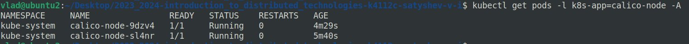
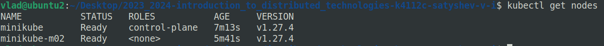
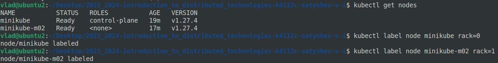
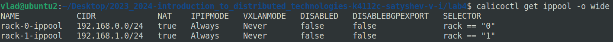
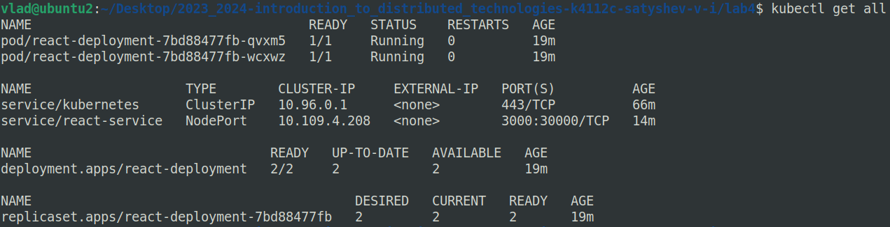
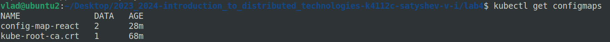
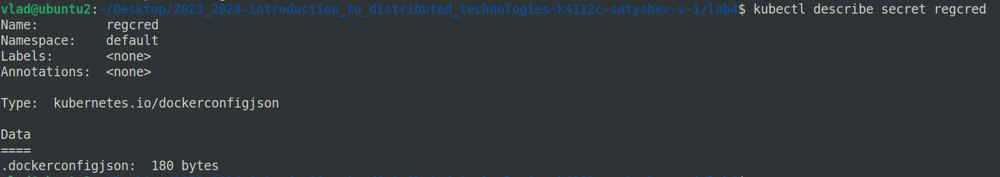
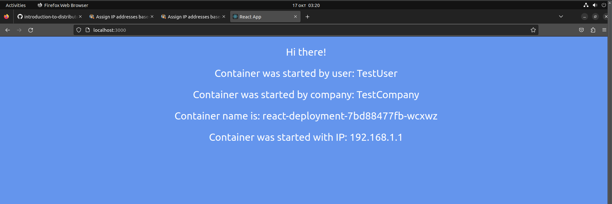
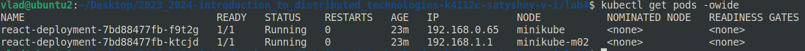

University: [ITMO University](https://itmo.ru/ru/)
Faculty: [FICT](https://fict.itmo.ru)
Course: [Introduction to distributed technologies](https://github.com/itmo-ict-faculty/introduction-to-distributed-technologies)
Year: 2023/2024
Group: K4112c
Author: Satyshev Vladislav Igorevich
Lab: Lab4
Date of create: 17.10.2023
Date of finished: 


# 1. Запуск minikube с плагином calico с 2 `Node`

Недостатком стандартной реализации сетевого взаимодействия в Kubernetes является низкая безопасность: сетевой трафик в/из `Pods` разрешен по умолчанию. Если не заблокировать сетевое взаимодействие с помощью сетевой политики (network policy), все `Pods` смогут свободно взаимодействовать с другими `Pods`.

Calico состоит из Container Network Interface (CNI) в виде подключаемого модуля к minikube, который обеспечивает сетевое взаимодействие между рабочим нагрузками (workloads) и из пакета сетевых политик (Calico network policy suite) для обеспечения безопасности облачных микросервисов/приложений любого масштаба. [source](https://docs.tigera.io/calico/latest/about/)

Запустим кластер minikube с CNI плагином Calico с двумя `Node`:

```bash
minikube start --network-plugin=cni --cni=calico --nodes 2
```
Покажем, что плагином Calico был успешно установлен в кластере:



Покажем, что в кластере имеется 2 `Node`:



# 2. Проверка режима `IPAM`

Укажем для запущенных `Node` `label` по признаку стойки:



Манифест для Calico который бы на основе ранее указанных меток назначает IP адреса `Pod` исходя из указанных пулов IP адресов представлен далее:

```yaml
manifest here
```

Манифест для второго `Node` аналогичен.

Выполним команду `calicoctl create` для данных манифестов и покажем, что было создано 2 `ippools`:



# 3. Создание `deployment` с двумя репликами

Создадим `Deployment` с двумя репликами [ifilyaninitmo/itdt-contained-frontend:master](https://hub.docker.com/repository/docker/ifilyaninitmo/itdt-contained-frontend), `ConfigMap` для передачи в `Pod` переменных окружения `REACT_APP_USERNAME` и `REACT_APP_COMPANY_NAME`, `Secret` для авторизации в Docker Hub, сервис для получения доступа к созданным `Pod`. Процесс создания и манифест файлы были описаны в отчете `lab2_report.md`.

Покажем, что были созданы `Deployment`, `ReplicaSet`, `Service`:



Покажем, что были создан `ConfigMap`:



Покажем, что были создан `Secret` `regcred`:



# 4. Проверка работы в браузере

Для подключения к созданным контейнерам через веб браузер перенаправим трафик с одного из портов клиентского устройства на порт сервиса, подобно тому, как это было выполнено в лабораторной работе №1 и 2:

```bash
minikube kubectl -- port-forward service/react-service 3000:3000
```

После этого React приложение становится доступным в браузере:



Заметим, что запущенным подам присвоены IP адреса из двух указанных в `ippools` диапазонов:




# 5. Пинг между `Pod`


