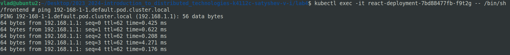
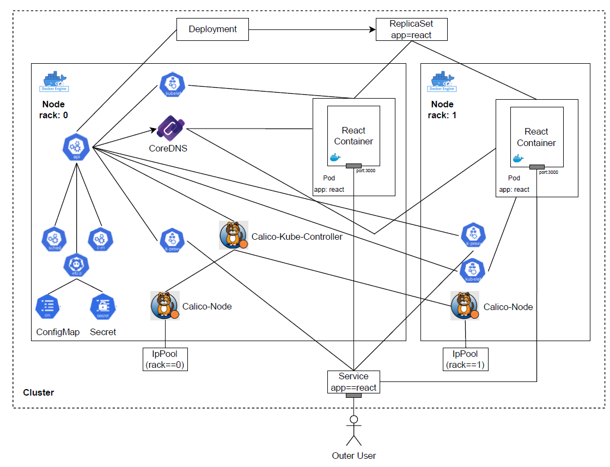

University: [ITMO University](https://itmo.ru/ru/)
Faculty: [FICT](https://fict.itmo.ru)
Course: [Introduction to distributed technologies](https://github.com/itmo-ict-faculty/introduction-to-distributed-technologies)
Year: 2023/2024
Group: K4112c
Author: Satyshev Vladislav Igorevich
Lab: Lab4
Date of create: 17.10.2023
Date of finished: 


# 1. Запуск minikube с плагином calico с двумя `Node`

Недостатком стандартной реализации сетевого взаимодействия в Kubernetes является низкая безопасность: сетевой трафик в/из `Pods` разрешен по умолчанию. Если не заблокировать сетевое взаимодействие с помощью сетевой политики (network policy), все `Pods` смогут свободно взаимодействовать с другими `Pods`.

Calico состоит из Container Network Interface (CNI) в виде подключаемого модуля к minikube, который обеспечивает сетевое взаимодействие между рабочим нагрузками (workloads) и из пакета сетевых политик (Calico network policy suite) для обеспечения безопасности облачных микросервисов/приложений любого масштаба. [source](https://docs.tigera.io/calico/latest/about/)

Запустим кластер minikube с CNI плагином Calico с двумя `Node`:

```bash
minikube start --network-plugin=cni --cni=calico --nodes 2
```
Покажем, что плагином Calico был успешно установлен в кластере:


Покажем, что в кластере имеется 2 `Node`:


# 2. Проверка режима `IPAM`

Удалим стандартный `IPPool` следующей командой:

```bash
calicoctl delete ippools default-ipv4-ippool
```

Укажем для запущенных `Node` `label` по признаку стойки:


Манифест для Calico, который на основе ранее указанных меток назначает IP адреса `Pod`, исходя из указанных пулов IP адресов, представлен далее:

```yaml
apiVersion: projectcalico.org/v3
kind: IPPool
metadata:
  name: rack-0-ippool
spec:
  cidr: 192.168.0.0/24
  ipipMode: Always
  natOutgoing: true
  nodeSelector: rack == "0"
```

- `spec.cidr` - указывается диапазон IP адресов, принадлежащих данному `IPPool` в соответствии с CIDR нотацией. В данном случае в создаваемый `IPPool` входят следующие IP адреса: `192.168.0.1`, `192.168.0.2`, ..., `192.168.0.254`.
- `spec.ipipMode: Always` - при установке `ipipMode: Always` Calico маршрутизирует весь трафик от хостов, поддерживающих Calico, используя "IP в IP", ко всем сетевым контейнерам и виртуальным машинам Calico в `IPPool` ([source](https://docs.tigera.io/calico/latest/networking/configuring/vxlan-ipip#configure-ip-in-ip-encapsulation-for-all-inter-workload-traffic)).
"IP in IP" — это протокол IP-туннелирования, который инкапсулирует один IP-пакет в другой IP-пакет. Это позволяет данным пересекать различные границы сети, сохраняя при этом информацию исходного IP-пакета в инкапсулированной структуре.
- `spec.natOutgoing: true` - включает outgoing NAT. Данный параметр необходим для того, чтобы обеспечить доступ `Pod` к IP адресам вне `IPPool` Calico ([source](https://docs.tigera.io/calico/latest/networking/configuring/workloads-outside-cluster#enable-nat-for-pods-with-ip-addresses-that-are-not-routable-beyond-the-cluster)). В данной работе значение этого параметра не критично, т.к. обеспечения такого рода взаимодействия не требуется.
- `nodeSelector` - селектор `Node`, подам которых будет присвоен соответствующий `IPPool`. В данном случае требуется наличие `label` `rack: 0`.

Манифест для второго `IPPool` аналогичен.

Выполним команду `calicoctl create` для данных манифестов и покажем, что было создано 2 `IPPool`:


# 3. Создание `deployment` с двумя репликами

Создадим `Deployment` с двумя репликами [ifilyaninitmo/itdt-contained-frontend:master](https://hub.docker.com/repository/docker/ifilyaninitmo/itdt-contained-frontend), `ConfigMap` для передачи в `Pod` переменных окружения `REACT_APP_USERNAME` и `REACT_APP_COMPANY_NAME`, `Secret` для авторизации в Docker Hub, сервис для получения доступа к созданным `Pod`. Процесс создания и манифест файлы были описаны в отчете `lab2_report.md`.

Покажем, что были созданы `Deployment`, `ReplicaSet`, `Service`:


Покажем, что был создан `ConfigMap`:


Покажем, что был создан `Secret` `regcred`:


# 4. Проверка работы в браузере

Для подключения к созданным контейнерам через веб браузер перенаправим трафик с одного из портов клиентского устройства на порт сервиса, подобно тому, как это было выполнено в лабораторной работе №1 и 2:

```bash
minikube kubectl -- port-forward service/react-service 3000:3000
```

После этого React приложение становится доступным в браузере:


Заметим, что запущенным подам присвоены IP адреса из двух указанных в `IPPool` диапазонов:


# 5. Пинг между `Pod`

Зайдем внутрь одного из `Pod` с помощью команды:

```bash
kubectl exec -it <pod_name> -- bin/sh/
```
и выполним команду `ping 192-168-1-1.default.pod.cluster.local`. `FQDN` `Pod` определен в соответствии с [документацией](https://kubernetes.io/docs/concepts/services-networking/dns-pod-service/#pods). 

Результат выполнения команды представлен на скриншоте:



# 6. Схема организации контейеров и сервисов

Схема организации контейеров и сервисов представлена на рисунке:



- kube-apiserver - API сервер, который связывает различные объекты Kubernetes друг с другом;
- kube-scheduler - используется для создания новых объектов рабочей нагузки (workload objects);
- kube-controller-manager - постоянно работающий процесс, который сравнивает текущее состояние кластера с желаемым. В случае несоответствия принимает меры по приведению состояния к желаемому. 
- etcd - строго согласованное, распределенное хранилище данных «ключ-значение», используемое для сохранения состояния кластера Kubernetes.
- docker engine - Kubernetes требует наличия среды выполнения контейнеров на нодах, т.к. на них запускаются контейнеры.
- kubelet - процесс, взаимодействующий с control plane: получает определения пода и взаимодействует со средой выполнения контейнеров для запуска указанных контейнеров. Также выполняет мониторинг состояния и ресурсов подов. В данном случае также отвечает за инициализацию переменных окружения из `ConfigMap` и аутентификацию с помощью `Secret`, информацию о которых получает посредством kube-apiserver. 
- kube-proxy - процесс, ответственный за динамические обновления и обслуживание всех сетевых правил на ноде. В частности, за настройку iptables.
- CoreDNS - DNS сервер. Взаимодействует с kube-apiserver для получения информации о новых `Pod`. При необходимости выполнить DNS resolution со стороны `Pod`, `Pod` обращается в CoreDNS.
- Calico-Kube-Controller - Взаимодействует с kube-apiserver для мониторинга состояния кластера ([source](https://docs.tigera.io/calico/latest/reference/kube-controllers/configuration)).
- Calico-Node - `Pod`, который создается Calico на каждом `Node` и который отвечает за:
  - Программирование маршрутов (Route Programming). На основе известных маршрутов к `Pods` в кластере Kubernetes настраивает Linux хост `Node` для осуществления маршрутизации в соответствии с заданными требованиями.
  - Совместное использование маршрутов (Route Sharing). На основе `Pods`, работающих на этом хосте, предоставляет механизм обмена известными маршрутами с другими хостами ([source](https://tanzu.vmware.com/developer/guides/container-networking-calico-refarch/#:~:text=calico%2Dnode&text=It%20is%20responsible%20for%202,known%20routes%20with%20other%20hosts.)).